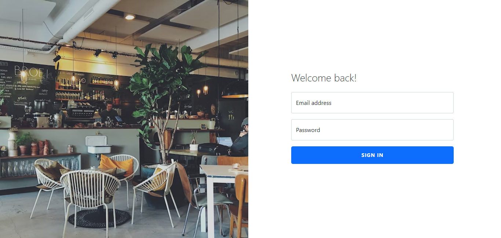
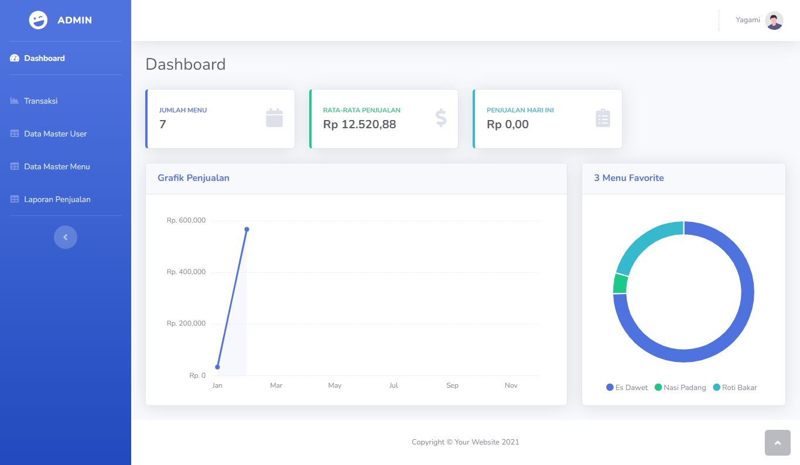
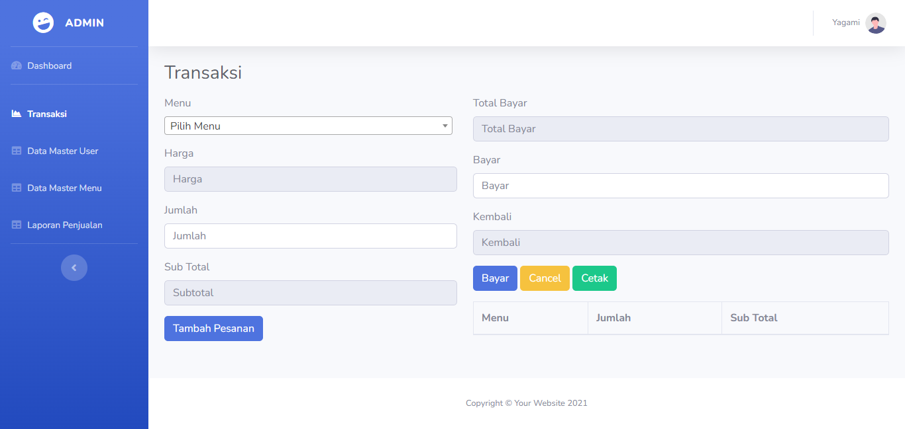
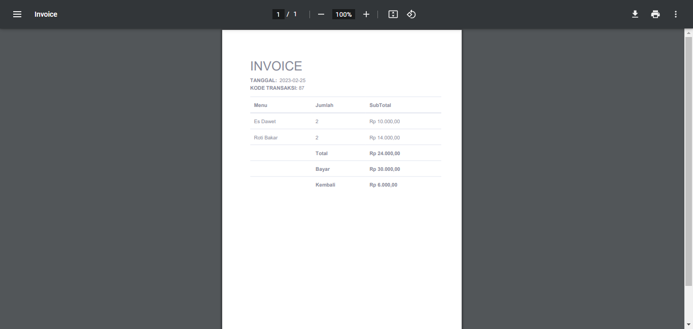
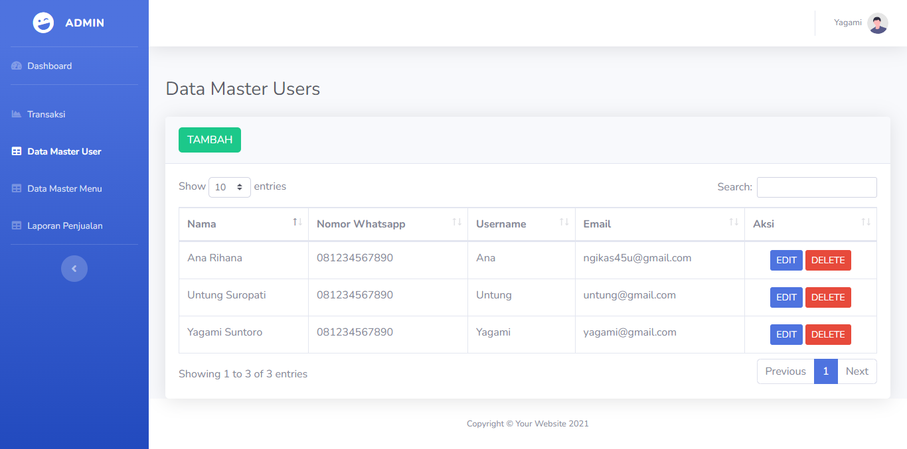
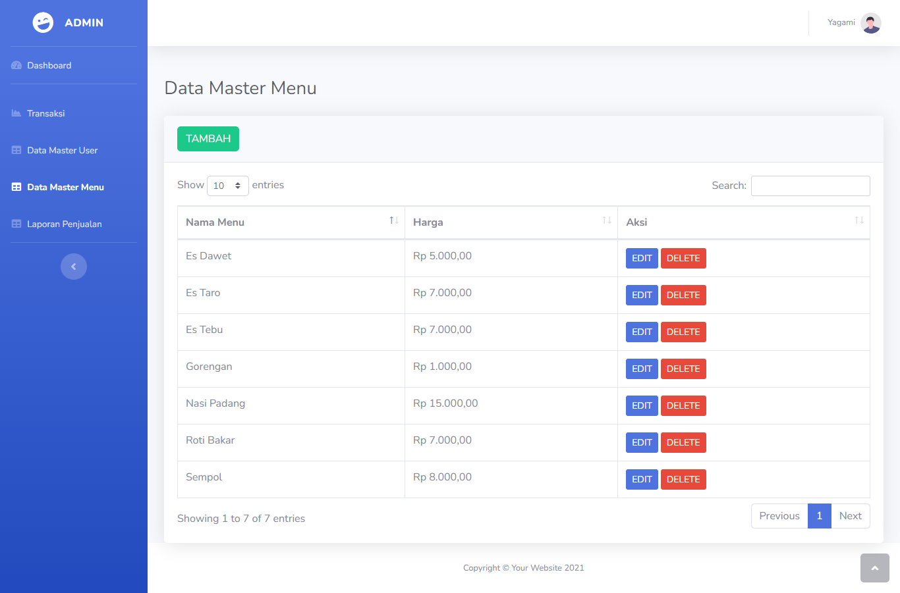
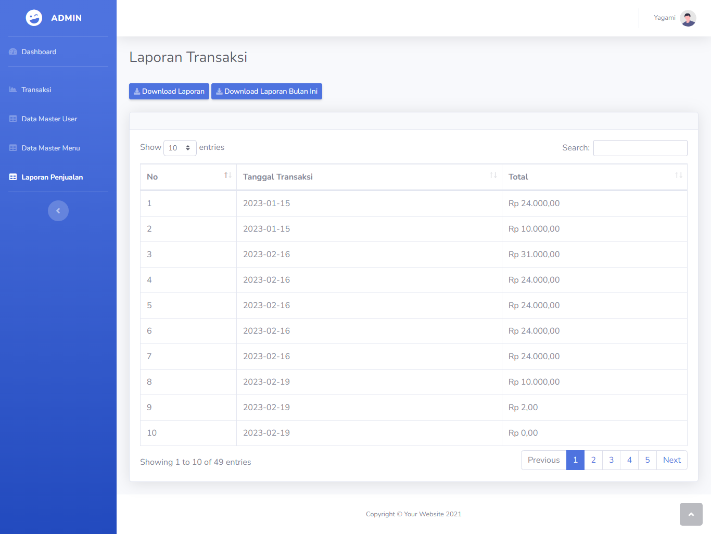
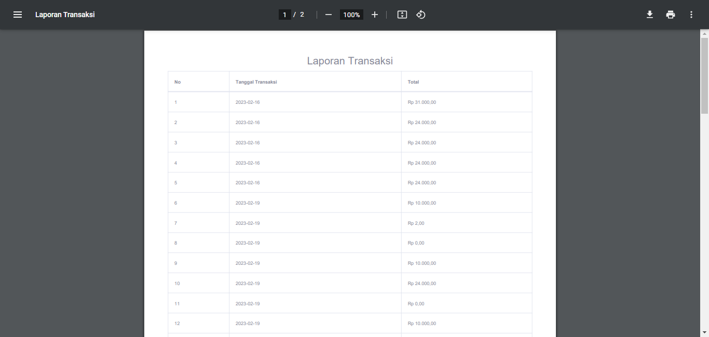

# Aplikasi Restaurant Laravel + Jquery
## Requirement
- PHP version 8
- Laravel 9
- Xamp version 3.3.0
- Mysql

## Fitur Aplikasi
- Dapat mengetahui jumlah menu, rata-rata penjualan, penjualan hari ini.
- Dapat mengetahui Grafik penjualan per bulan.
- Dapat mengetahui 3 menu favorit
- Dapat mencetak laporan penjualan dan invoice dalam bentuk PDF
- Dapat mengelola menu, user

## Screenshoot
- Halaman Login

- Halaman Dashboard

- Halaman Transaksi

- Invoice

- Halaman Users

- Halaman Menu

- Halaman Laporan

- Laporan

